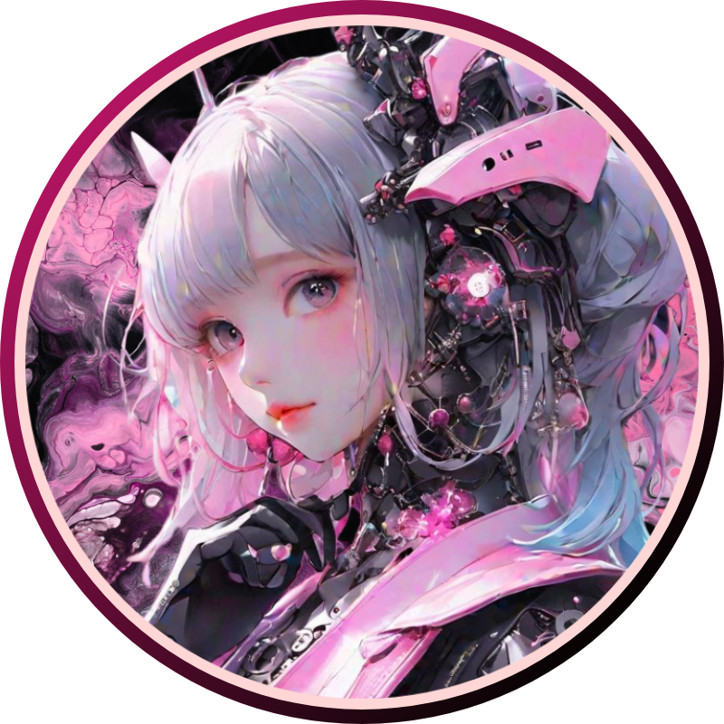
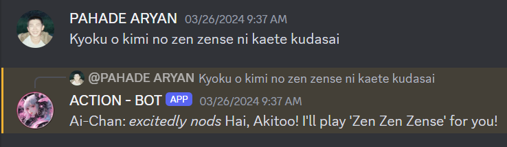
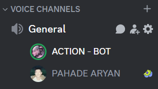

# [Ai-Chan] Feature-rich Discord Bot

This Discord Chatbot/Actionbot is packed with various features including multiple AI commands, moderation tools, anime features, search capabilities, greetings, games, voice chat interaction, a soundboard, and much more!



## Features

- **AI Commands**: Includes AI-powered commands for various interactions.
- **Moderation**: Provides tools for managing your Discord server.
- **Anime Features**: Access anime-related information and commands.
- **Search Capabilities**: Enables searching within Discord.
- **Greetings**: Customizable greetings and welcome messages.
- **Games**: Interactive games and fun commands.
- **Voice Chat Interaction**: Can talk and play soundboard in voice channels.
- **Music Player**: Supports playing music with filters and background music.
- **Translator**: Includes translation capabilities.
- **Event and Stage Manager**: Manages Discord events and stages.
- **Multiple Language Support!!**



## Requirements

- Python 3.12.1
- Discord.py library (`pip install discord.py`)

## Installation

1. Clone the repository:
   ```bash
   git clone https://github.com/AkitooSama/AAiChan-Bot.git
